# ChainMate Architecture Diagrams

## 1. System Overview - High Level Architecture

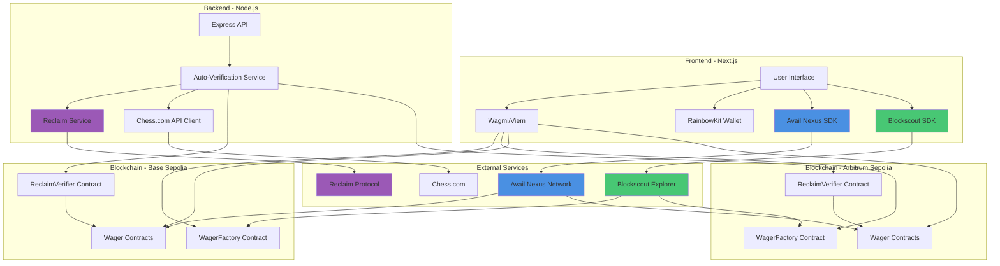

---

## 2. Complete Wager Lifecycle Flow

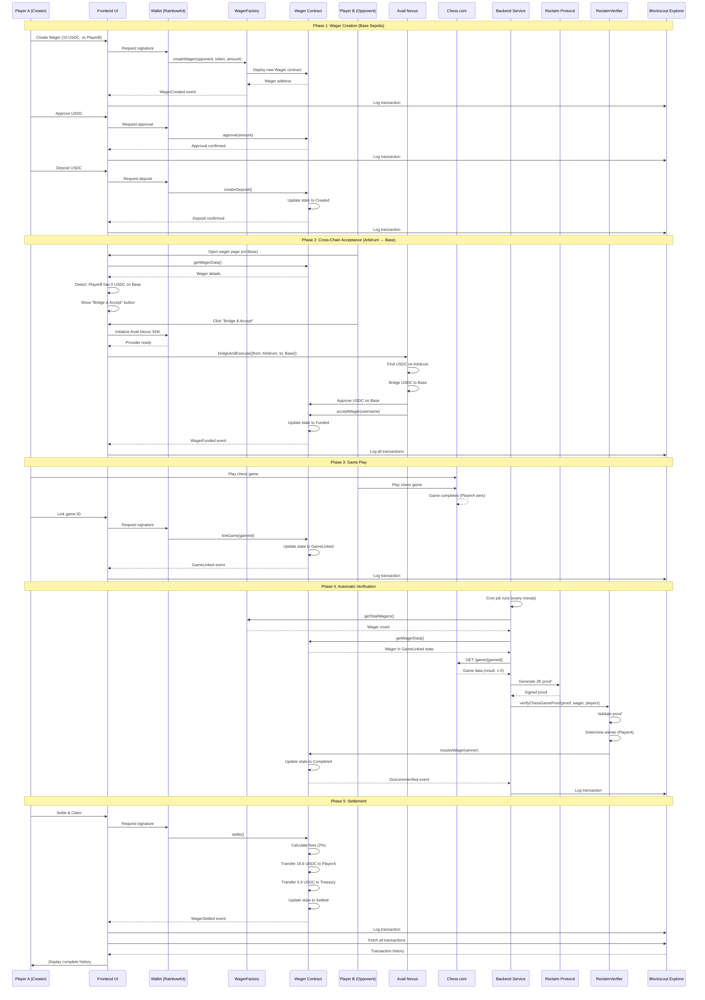

---

## 3. Smart Contract Architecture

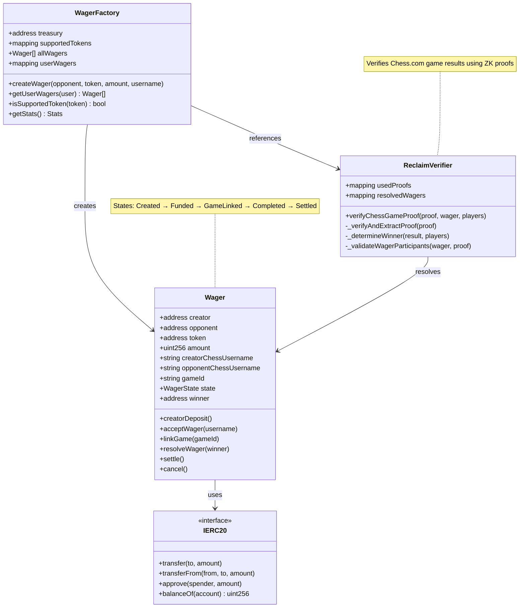

---

## 4. Frontend Component Architecture

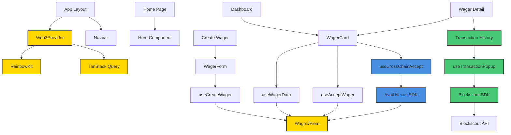

---

## 5. Backend Service Architecture

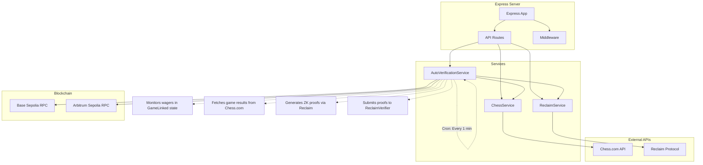

---

## 6. Cross-Chain Flow with Avail Nexus

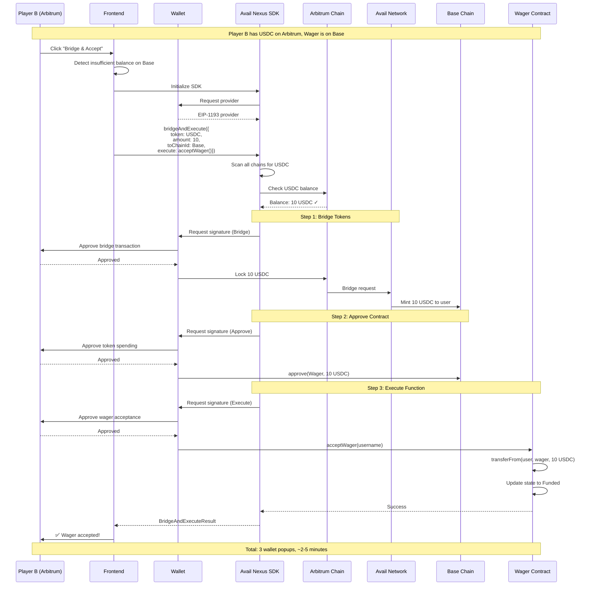

---

## 7. Verification Flow with Reclaim Protocol

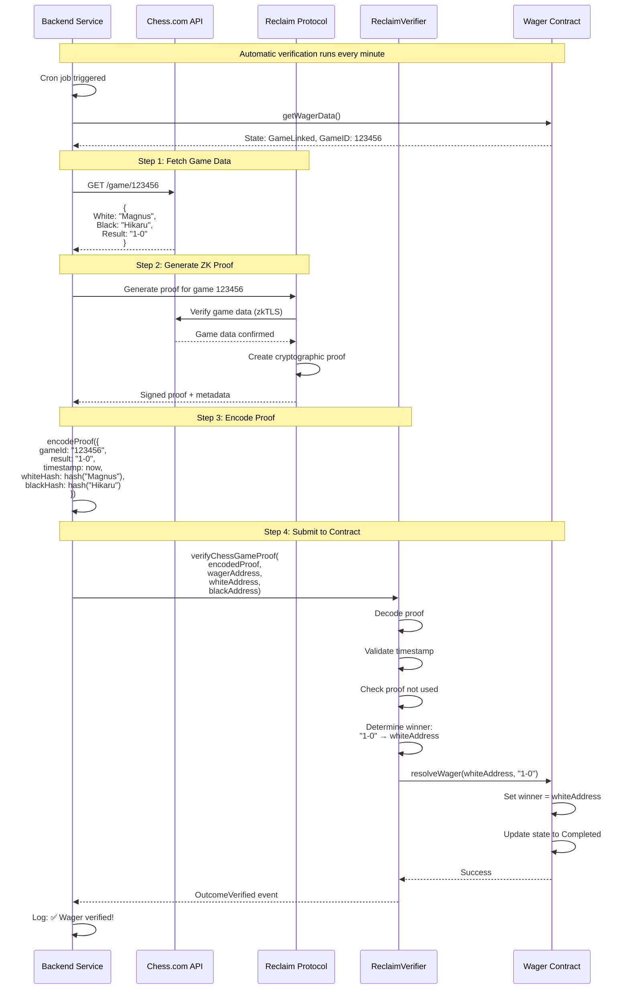

---

## 8. Blockscout Integration

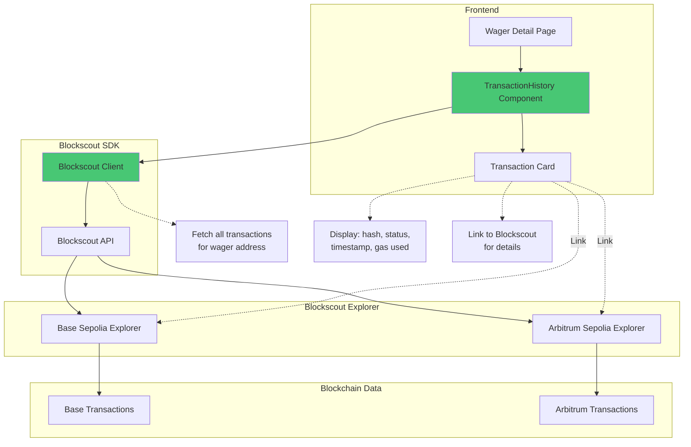

---

## 9. Data Flow - Token Transfers

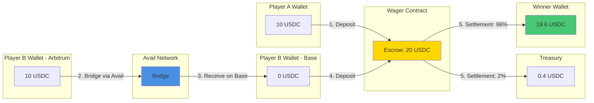

---

## 10. Technology Stack Overview

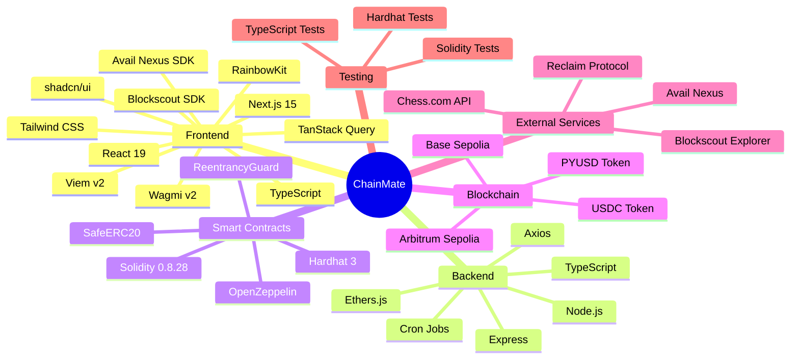

---

## 11. Prize Track Integration Points

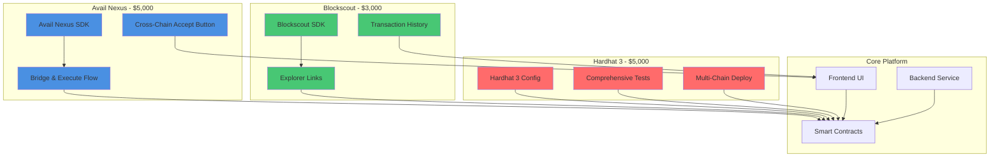

---

## 12. Deployment Architecture

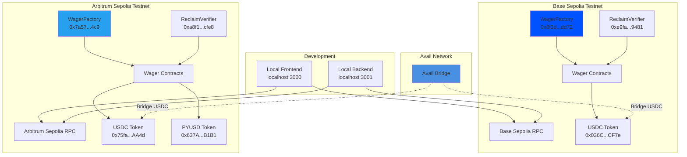

---

## Legend

- 🔵 Blue: Avail Nexus Integration
- 🟢 Green: Blockscout Integration  
- 🔴 Red: Hardhat 3 Integration
- 🟡 Yellow: Core Platform Components
- 🟣 Purple: Reclaim Protocol Integration

---

These diagrams are rendered automatically by GitHub, GitLab, and most Markdown viewers!
