# ChainMate Architecture Diagrams

## 1. System Overview - High Level Architecture

---

## 2. Complete Wager Lifecycle Flow

---

## 3. Smart Contract Architecture

```mermaid
classDiagram
    class WagerFactory {
        +address treasury
        +mapping supportedTokens
        +Wager[] allWagers
        +mapping userWagers
        +createWager(opponent, token, amount, username)
        +getUserWagers(user) Wager[]
        +isSupportedToken(token) bool
        +getStats() Stats
    }

    class Wager {
        +address creator
        +address opponent
        +address token
        +uint256 amount
        +string creatorChessUsername
        +string opponentChessUsername
        +string gameId
        +WagerState state
        +address winner
        +creatorDeposit()
        +acceptWager(username)
        +linkGame(gameId)
        +resolveWager(winner)
        +settle()
        +cancel()
    }

    class ReclaimVerifier {
        +mapping usedProofs
        +mapping resolvedWagers
        +verifyChessGameProof(proof, wager, players)
        -_verifyAndExtractProof(proof)
        -_determineWinner(result, players)
        -_validateWagerParticipants(wager, proof)
    }

    class IERC20 {
        <<interface>>
        +transfer(to, amount)
        +transferFrom(from, to, amount)
        +approve(spender, amount)
        +balanceOf(account) uint256
    }

    WagerFactory --> Wager : creates
    Wager --> IERC20 : uses
    ReclaimVerifier --> Wager : resolves
    WagerFactory --> ReclaimVerifier : references

    note for Wager "States: Created → Funded → GameLinked → Completed → Settled"
    note for ReclaimVerifier "Verifies Chess.com game results using ZK proofs"
```

---

## 4. Frontend Component Architecture

---

## 5. Backend Service Architecture

---

## 6. Cross-Chain Flow with Avail Nexus

---

## 7. Verification Flow with Reclaim Protocol

---

## 8. Blockscout Integration

---

## 9. Data Flow - Token Transfers

---

## 10. Technology Stack Overview

---

## 11. Prize Track Integration Points

---

## 12. Deployment Architecture

---

## Legend

- 🔵 Blue: Avail Nexus Integration
- 🟢 Green: Blockscout Integration  
- 🔴 Red: Hardhat 3 Integration
- 🟡 Yellow: Core Platform Components
- 🟣 Purple: Reclaim Protocol Integration

---

These diagrams are rendered automatically by GitHub, GitLab, and most Markdown viewers!
