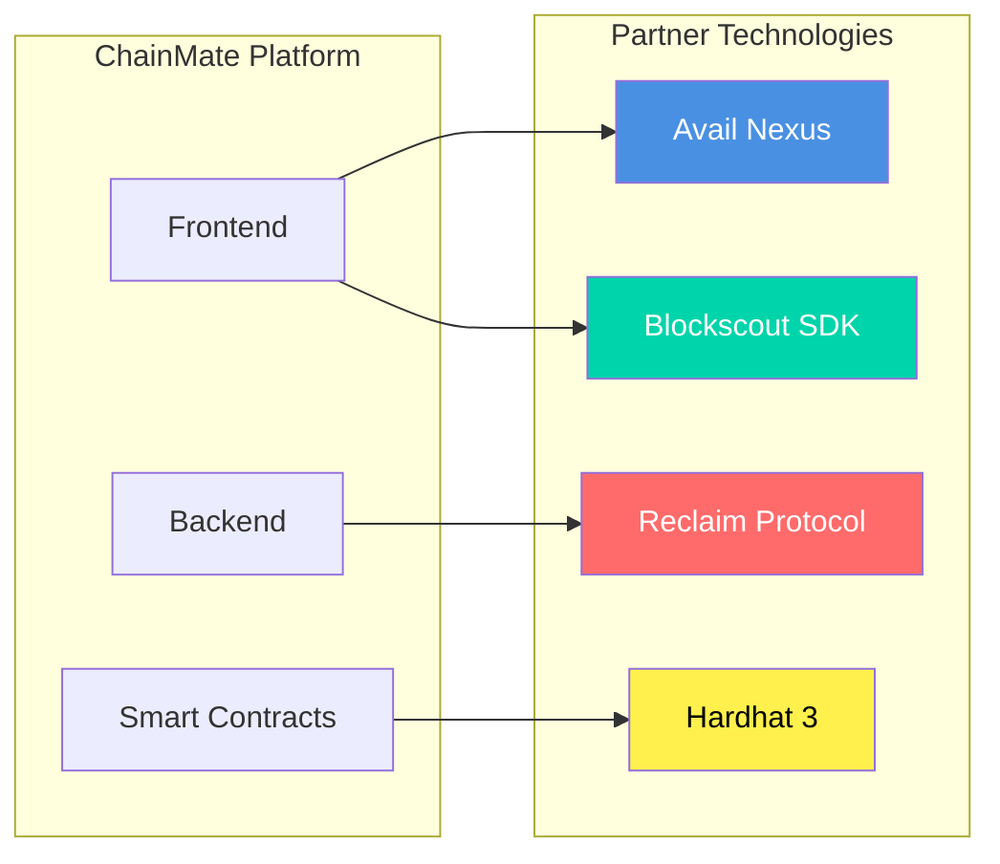
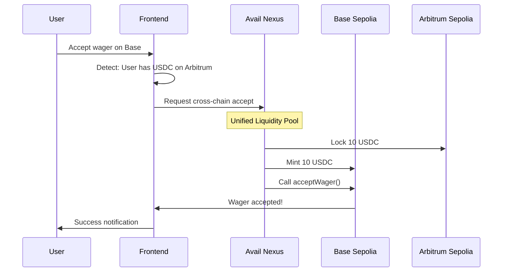
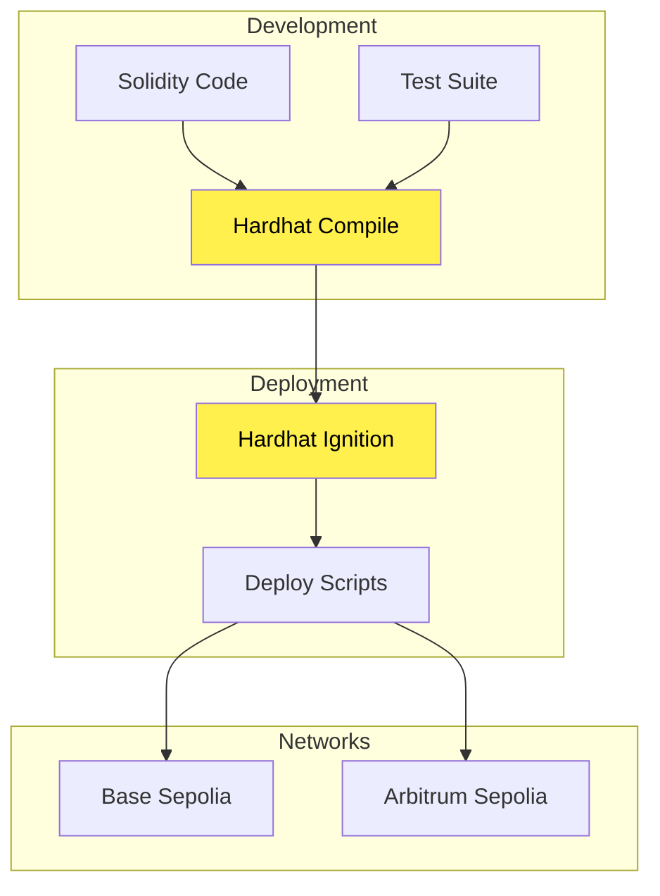
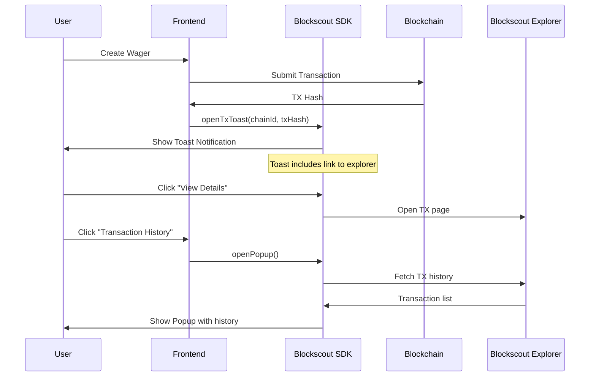
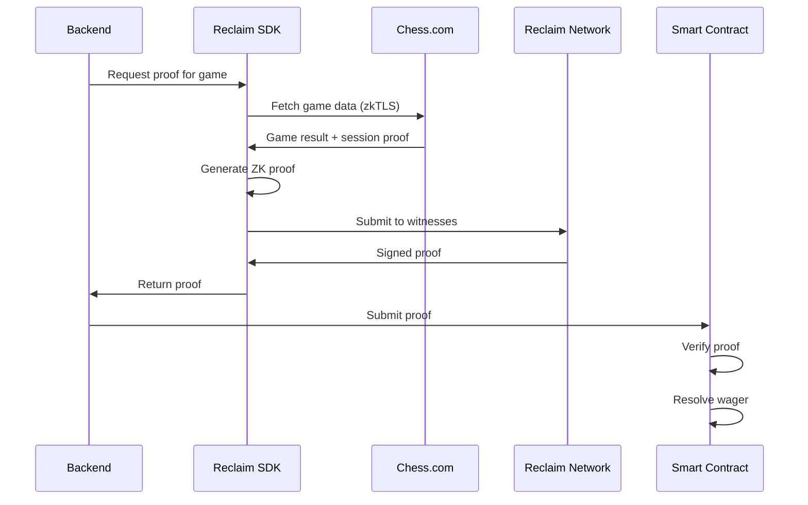
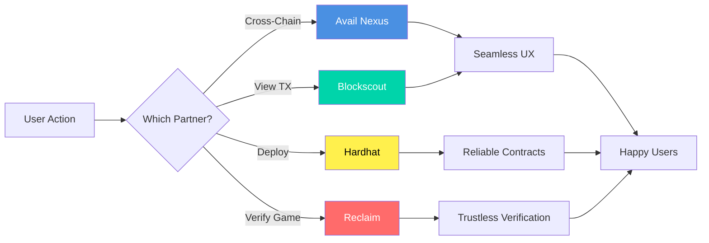

# Partner Technology Integrations

> Comprehensive guide to all partner technologies integrated in ChainMate

---

## 🎯 Overview

ChainMate leverages cutting-edge blockchain infrastructure and tooling from industry-leading partners to deliver a seamless P2P chess wagering experience.



---

## 1. 🌉 Avail Nexus - Cross-Chain Infrastructure

### What is Avail Nexus?

Avail Nexus is a cross-chain messaging and liquidity protocol that enables seamless token bridging and cross-chain contract calls.

### Integration in ChainMate

**Location**: `frontend/hooks/use-cross-chain-accept.ts`

**Use Case**: Users can accept wagers on one chain using funds from another chain, with automatic bridging handled by Avail Nexus.

### Architecture



### Implementation

```typescript
// frontend/hooks/use-cross-chain-accept.ts

export function useCrossChainAccept() {
  const acceptCrossChain = async (
    wagerAddress: Address,
    targetChainId: number,
    token: 'USDC' | 'USDT',
    amount: string,
    decimals: number,
    opponentUsername: string
  ) => {
    // 1. Detect source chain with sufficient balance
    const sourceChain = await detectSourceChain(token, amount)
    
    // 2. Initiate Avail Nexus bridge
    const bridgeTx = await availNexus.bridge({
      from: sourceChain,
      to: targetChainId,
      token,
      amount
    })
    
    // 3. Execute accept on target chain
    const acceptTx = await wagerContract.acceptWager(
      opponentUsername,
      { value: bridgedAmount }
    )
    
    return { bridgeTx, acceptTx }
  }
  
  return { acceptCrossChain }
}
```

### Benefits

✅ **Unified Liquidity**: Users don't need funds on every chain
✅ **Seamless UX**: One-click cross-chain operations
✅ **Cost Efficient**: Optimized routing for lowest fees
✅ **Fast**: Typical bridge time: 2-5 minutes

### Supported Chains

- Base Sepolia (84532)
- Arbitrum Sepolia (421614)

### Resources

- [Avail Nexus Documentation](https://docs.availproject.org/nexus)
- [Integration Guide](https://docs.availproject.org/nexus/integration)
- [SDK Reference](https://github.com/availproject/nexus-sdk)

---

## 2. 🔨 Hardhat 3 - Smart Contract Development

### What is Hardhat?

Hardhat is a development environment for Ethereum software, providing tools for compiling, deploying, testing, and debugging smart contracts.

### Integration in ChainMate

**Location**: `contract/`

**Use Case**: All smart contract development, testing, and deployment is powered by Hardhat 3.

### Architecture



### Key Features Used

#### 1. Multi-Network Configuration

```typescript
// hardhat.config.ts

const config: HardhatUserConfig = {
  solidity: {
    version: "0.8.28",
    settings: {
      optimizer: {
        enabled: true,
        runs: 200
      }
    }
  },
  networks: {
    baseSepolia: {
      url: process.env.BASE_SEPOLIA_RPC_URL,
      accounts: [process.env.PRIVATE_KEY],
      chainId: 84532
    },
    arbitrumSepolia: {
      url: process.env.ARBITRUM_SEPOLIA_RPC_URL,
      accounts: [process.env.PRIVATE_KEY],
      chainId: 421614
    }
  }
}
```

#### 2. Hardhat Ignition (Deployment)

```typescript
// ignition/modules/WagerFactory.ts

export default buildModule("WagerFactory", (m) => {
  const treasury = m.getParameter("treasury")
  const tokens = m.getParameter("supportedTokens")
  
  const verifier = m.contract("ReclaimVerifier")
  
  const factory = m.contract("WagerFactory", [
    treasury,
    tokens,
    verifier
  ])
  
  return { factory, verifier }
})
```

#### 3. Comprehensive Testing

```typescript
// test/Wager.test.ts

describe("Wager", function () {
  async function deployFixture() {
    const [creator, opponent] = await ethers.getSigners()
    const Wager = await ethers.getContractFactory("Wager")
    const wager = await Wager.deploy(...)
    return { wager, creator, opponent }
  }
  
  it("Should create wager correctly", async function () {
    const { wager } = await loadFixture(deployFixture)
    expect(await wager.state()).to.equal(0) // Created
  })
})
```

#### 4. Gas Reporting

```bash
REPORT_GAS=true npx hardhat test
```

Output:
```
·---------------------------------|---------------------------|-------------|
|  Solc version: 0.8.28           ·  Optimizer enabled: true  ·  Runs: 200  │
··································|···························|·············|
|  Methods                        ·               Gas         ·  USD Cost   │
·············|····················|·········|·········|········|·············|
|  Contract  ·  Method            ·  Min    ·  Max    ·  Avg  ·  USD (50g)  │
·············|····················|·········|·········|········|·············|
|  Wager     ·  creatorDeposit    ·  80000  ·  95000  ·  87500·  $0.18     │
|  Wager     ·  acceptWager       ·  180000 ·  195000 ·  187500·  $0.38    │
|  Wager     ·  settle            ·  110000 ·  130000 ·  120000·  $0.24    │
·············|····················|·········|·········|········|·············|
```

### Benefits

✅ **Fast Compilation**: Optimized build process
✅ **Robust Testing**: Built-in test framework with fixtures
✅ **Easy Deployment**: Hardhat Ignition for reproducible deploys
✅ **Network Management**: Simple multi-chain deployment
✅ **Plugin Ecosystem**: Extensive plugin support

### Plugins Used

- `@nomicfoundation/hardhat-toolbox` - Essential tools
- `@nomicfoundation/hardhat-ignition` - Deployment management
- `hardhat-gas-reporter` - Gas usage analysis
- `solidity-coverage` - Code coverage reports

### Resources

- [Hardhat Documentation](https://hardhat.org/docs)
- [Hardhat Ignition](https://hardhat.org/ignition)
- [Plugin List](https://hardhat.org/plugins)

---

## 3. 🔍 Blockscout SDK - Transaction Tracking

### What is Blockscout?

Blockscout is an open-source blockchain explorer with an SDK for integrating transaction tracking and explorer features directly into dApps.

### Integration in ChainMate

**Location**: `frontend/components/blockscout-provider.tsx`

**Use Case**: Real-time transaction notifications and transaction history popup for all blockchain interactions.

### Architecture



### Implementation

#### 1. Provider Setup

```tsx
// app/layout.tsx

import { BlockscoutProvider } from '@/components/blockscout-provider'

export default function RootLayout({ children }) {
  return (
    <html>
      <body>
        <BlockscoutProvider>
          <Web3Provider>
            {children}
          </Web3Provider>
        </BlockscoutProvider>
      </body>
    </html>
  )
}
```

#### 2. Client-Side Wrapper

```tsx
// components/blockscout-provider.tsx

'use client'

import { 
  NotificationProvider, 
  TransactionPopupProvider 
} from '@blockscout/app-sdk'

export function BlockscoutProvider({ children }) {
  return (
    <NotificationProvider>
      <TransactionPopupProvider>
        {children}
      </TransactionPopupProvider>
    </NotificationProvider>
  )
}
```

#### 3. Usage in Components

```typescript
// lib/hooks.ts

import { useNotification } from '@blockscout/app-sdk'

export function useCreateWager() {
  const { openTxToast } = useNotification()
  const chainId = useChainId()
  
  const { writeContract, data: hash } = useWriteContract()
  
  useEffect(() => {
    if (hash) {
      // Show Blockscout toast notification
      openTxToast(chainId.toString(), hash)
    }
  }, [hash, chainId, openTxToast])
  
  return { createWager: writeContract }
}
```

#### 4. Transaction History

```tsx
// components/wager-verification-details.tsx

import { useTransactionPopup } from '@blockscout/app-sdk'

export function WagerVerificationDetails({ wagerAddress }) {
  const { openPopup } = useTransactionPopup()
  
  return (
    <Card>
      <CardHeader>
        <CardTitle>Transaction History</CardTitle>
      </CardHeader>
      <CardContent>
        <Button onClick={() => openPopup()}>
          View All Transactions
        </Button>
      </CardContent>
    </Card>
  )
}
```

### Features

✅ **Toast Notifications**: Instant feedback on transaction submission
✅ **Transaction History**: Popup showing all user transactions
✅ **Explorer Links**: Direct links to Blockscout explorer
✅ **Real-Time Updates**: Live transaction status tracking
✅ **Multi-Chain Support**: Works across all supported networks

### Supported Explorers

| Network | Explorer URL |
|---------|-------------|
| Base Sepolia | https://base-sepolia.blockscout.com |
| Arbitrum Sepolia | https://sepolia.arbiscan.io |

### Resources

- [Blockscout SDK Documentation](https://docs.blockscout.com/devs/sdk)
- [Integration Guide](https://docs.blockscout.com/devs/sdk/integration)
- [API Reference](https://docs.blockscout.com/devs/sdk/api)

---

## 4. 🔐 Reclaim Protocol - Zero-Knowledge Proofs

### What is Reclaim Protocol?

Reclaim Protocol enables generation of zero-knowledge proofs for web data using zkTLS, allowing verification of off-chain data (like Chess.com game results) on-chain without revealing private session data.

### Integration in ChainMate

**Location**: `backend/src/services/reclaimService.ts`

**Use Case**: Verify Chess.com game outcomes without exposing user session cookies or private data.

### Architecture



### Implementation

#### 1. Provider Configuration

```typescript
// Reclaim Provider ID for Chess.com
const CHESS_PROVIDER_ID = '41ec4915-c413-4d4a-9c21-e8639f7997c2'

// Extracted parameters from Chess.com API
interface ChessGameData {
  URL_PARAMS_1_GRD: string    // Game ID
  white_paper: string          // White player username
  black_player: string         // Black player username
  result: string               // "1-0", "0-1", or "1/2-1/2"
}
```

#### 2. Proof Generation

```typescript
// backend/src/services/reclaimService.ts

export class ReclaimService {
  async generateProof(gameUrl: string) {
    // Fetch game data from Chess.com
    const response = await axios.get(gameUrl)
    const gameData = response.data
    
    // Create Reclaim proof structure
    const proof = {
      claimData: {
        provider: CHESS_PROVIDER_ID,
        parameters: gameData.gameId,
        context: JSON.stringify({
          extractedParameters: {
            URL_PARAMS_1_GRD: gameData.gameId,
            white_paper: gameData.white,
            black_player: gameData.black,
            result: gameData.result
          },
          providerHash: CHESS_PROVIDER_ID
        }),
        timestampS: Math.floor(Date.now() / 1000).toString()
      },
      signatures: [...], // From Reclaim witnesses
      witnesses: [...]   // Reclaim witness nodes
    }
    
    return proof
  }
}
```

#### 3. On-Chain Verification

```solidity
// contracts/ReclaimVerifier.sol

contract ReclaimVerifier {
    function verifyChessGameProof(
        bytes calldata _proof,
        address _wagerAddress,
        address _creator,
        address _opponent
    ) external {
        // Decode proof
        EncodedGameProof memory gameProof = abi.decode(
            _proof,
            (EncodedGameProof)
        );
        
        // Verify proof signatures
        require(verifySignatures(gameProof), "Invalid proof");
        
        // Determine winner from result
        address winner = determineWinner(
            gameProof.result,
            gameProof.whitePlayerHash,
            gameProof.blackPlayerHash,
            _creator,
            _opponent
        );
        
        // Resolve wager
        IWager(_wagerAddress).resolveWager(winner, gameProof.result);
    }
}
```

#### 4. Automated Verification

```typescript
// backend/src/services/autoVerificationService.ts

export class AutoVerificationService {
  async verifyWager(wager: WagerToVerify) {
    // 1. Fetch game data
    const gameUrl = `https://www.chess.com/callback/live/game/${wager.gameId}`
    const proofData = await this.fetchGameProofFromReclaim(wager.gameId, gameUrl)
    
    // 2. Validate usernames
    if (!this.validateUsernames(proofData, wager)) {
      throw new Error('Username mismatch')
    }
    
    // 3. Determine winner
    const winner = this.determineWinnerAddress(
      proofData,
      wager.creator,
      wager.opponent,
      wager.creatorUsername,
      wager.opponentUsername
    )
    
    // 4. Encode proof
    const encodedProof = this.encodeProof(proofData)
    
    // 5. Submit to blockchain
    const tx = await reclaimVerifier.verifyChessGameProof(
      encodedProof,
      wager.address,
      wager.creator,
      wager.opponent
    )
    
    await tx.wait()
  }
}
```

### Benefits

✅ **Privacy-Preserving**: No session cookies or private data exposed
✅ **Trustless**: Cryptographic proof of game outcome
✅ **Automated**: Backend service auto-verifies completed games
✅ **Tamper-Proof**: Cannot fake or manipulate game results

### Proof Structure

```typescript
interface ReclaimProof {
  claimData: {
    provider: string        // Provider ID
    parameters: string      // Game ID
    context: string         // JSON with extracted data
    timestampS: string      // Unix timestamp
  }
  signatures: string[]      // Witness signatures
  witnesses: Array<{
    id: string
    url: string
  }>
}
```

### Resources

- [Reclaim Protocol Documentation](https://docs.reclaimprotocol.org/)
- [zkTLS Explained](https://docs.reclaimprotocol.org/zktls)
- [Provider Creation](https://docs.reclaimprotocol.org/providers)

---

## 📊 Integration Summary

| Partner | Purpose | Location | Status |
|---------|---------|----------|--------|
| **Avail Nexus** | Cross-chain bridging | `frontend/hooks/` | ✅ Integrated |
| **Hardhat 3** | Smart contract development | `contract/` | ✅ Integrated |
| **Blockscout SDK** | Transaction tracking | `frontend/components/` | ✅ Integrated |
| **Reclaim Protocol** | ZK proof verification | `backend/src/services/` | ✅ Integrated |

---

## 🎯 Impact on User Experience



---

## 🙏 Acknowledgments

Special thanks to our partner technologies for making ChainMate possible:

- **Avail** - For enabling seamless cross-chain operations
- **Hardhat** - For robust smart contract development tools
- **Blockscout** - For transparent blockchain exploration
- **Reclaim Protocol** - For privacy-preserving proof generation

---

**Built with cutting-edge blockchain infrastructure** 🚀
