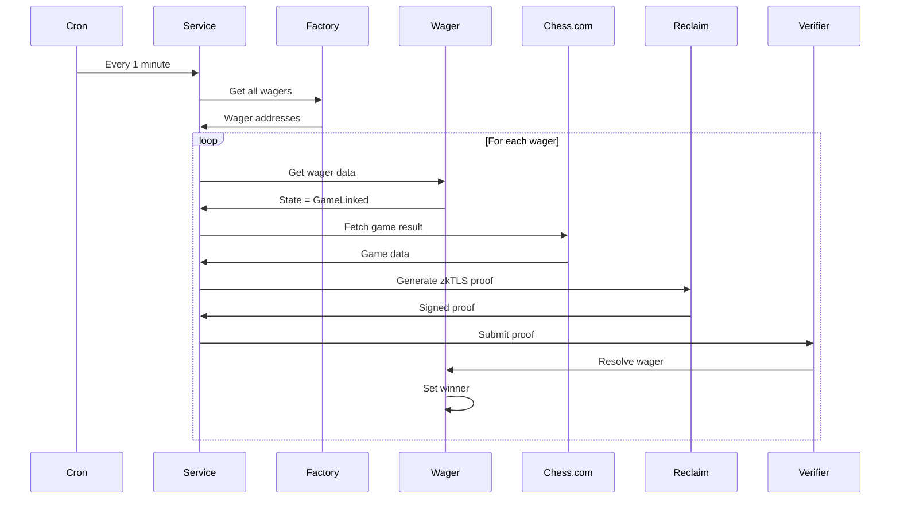

# ChainMate Backend

> Node.js + Express backend with automated Chess.com game verification via Reclaim Protocol

## 🏗️ Tech Stack

- **Runtime**: Node.js 18+
- **Framework**: Express.js
- **Language**: TypeScript
- **Blockchain**: Ethers.js v6
- **Scheduling**: node-cron
- **Logging**: Pino
- **Testing**: Jest

---

## 📁 Project Structure

```
backend/
├── src/
│   ├── index.ts                 # Main server entry point
│   ├── routes/                  # API endpoints
│   │   ├── health.ts           # Health check
│   │   ├── reclaim.ts          # Reclaim proof generation
│   │   └── verification.ts     # Manual verification
│   │
│   ├── services/                # Business logic
│   │   ├── autoVerificationService.ts  # Auto-verify games
│   │   ├── reclaimService.ts          # Reclaim SDK wrapper
│   │   └── chessService.ts            # Chess.com API
│   │
│   ├── contracts/               # Smart contract ABIs
│   │   └── abis.ts             # Contract interfaces
│   │
│   └── middleware/              # Express middleware
│       ├── errorHandler.ts     # Error handling
│       └── logger.ts           # Request logging
│
├── logs/                        # Service logs
├── dist/                        # Compiled JavaScript
└── tests/                       # Unit tests
```

---

## 🚀 Getting Started

### Prerequisites

- Node.js 18+
- npm or yarn
- Private key for verifier wallet
- RPC URLs for target chains

### Installation

```bash
# Install dependencies
npm install

# Copy environment variables
cp .env.example .env

# Build TypeScript
npm run build

# Start server
npm run dev
```

### Environment Variables

Create `.env`:

```env
# Server
PORT=3001
NODE_ENV=development

# Verifier Wallet
VERIFIER_PRIVATE_KEY=0x...

# Base Sepolia
BASE_SEPOLIA_RPC_URL=https://sepolia.base.org
BASE_RECLAIM_VERIFIER_ADDRESS=0x...
BASE_WAGER_FACTORY_ADDRESS=0x...

# Arbitrum Sepolia
ARBITRUM_SEPOLIA_RPC_URL=https://sepolia-rollup.arbitrum.io/rpc
ARBITRUM_RECLAIM_VERIFIER_ADDRESS=0x...
ARBITRUM_WAGER_FACTORY_ADDRESS=0x...

# Reclaim Protocol
RECLAIM_APP_ID=your_app_id
RECLAIM_APP_SECRET=your_app_secret

# Logging
LOG_LEVEL=info
```

---

## 🔌 API Endpoints

### Health Check

```http
GET /api/health
```

**Response**:
```json
{
  "status": "ok",
  "timestamp": "2024-10-16T19:00:00.000Z",
  "uptime": 3600,
  "service": "chainmate-backend"
}
```

---

### Generate Reclaim Proof

```http
POST /api/reclaim/generate-proof
Content-Type: application/json

{
  "gameUrl": "https://www.chess.com/game/live/123456789"
}
```

**Response**:
```json
{
  "success": true,
  "proof": {
    "claimData": {...},
    "signatures": [...],
    "witnesses": [...]
  }
}
```

---

### Manual Verification

```http
POST /api/verification/verify-wager
Content-Type: application/json

{
  "wagerAddress": "0x...",
  "chainId": 84532
}
```

**Response**:
```json
{
  "success": true,
  "txHash": "0x...",
  "winner": "0x...",
  "result": "1-0"
}
```

---

### Verification Service Status

```http
GET /api/verification/status
```

**Response**:
```json
{
  "isRunning": true,
  "wallet": "0x...",
  "chains": [
    {
      "name": "Base Sepolia",
      "chainId": 84532,
      "reclaimVerifier": "0x...",
      "wagerFactory": "0x..."
    }
  ],
  "chainsCount": 2
}
```

---

## 🤖 Auto-Verification Service

The auto-verification service runs continuously, checking for completed Chess.com games and submitting proofs to the blockchain.

### How It Works



### Starting the Service

```bash
# Development mode (with auto-reload)
npm run verify:dev

# Production mode
npm run verify

# As background service
npm run verify:daemon
```

### Service Logs

Logs are written to `logs/` directory:

```
logs/
├── verification-2024-10-16.log
├── verification-2024-10-17.log
└── error.log
```

### Configuration

```typescript
// src/services/autoVerificationService.ts

export class AutoVerificationService {
  private checkInterval: number = 60000 // 1 minute
  
  // Customize check interval
  constructor(checkInterval?: number) {
    this.checkInterval = checkInterval || 60000
  }
}
```

---

## 🔐 Reclaim Protocol Integration

### Provider Configuration

**Provider ID**: `41ec4915-c413-4d4a-9c21-e8639f7997c2`

**Extracted Parameters**:
- `URL_PARAMS_1_GRD`: Game ID
- `white_paper`: White player username
- `black_player`: Black player username
- `result`: Game result (1-0, 0-1, 1/2-1/2)

### Proof Generation

```typescript
import { reclaimService } from './services/reclaimService'

const proof = await reclaimService.generateProof(
  'https://www.chess.com/game/live/123456789'
)

// Proof structure
{
  claimData: {
    provider: '41ec4915-c413-4d4a-9c21-e8639f7997c2',
    parameters: '123456789',
    context: JSON.stringify({
      extractedParameters: {
        URL_PARAMS_1_GRD: '123456789',
        white_paper: 'player1',
        black_player: 'player2',
        result: '1-0'
      }
    }),
    timestampS: '1697472000'
  },
  signatures: [...],
  witnesses: [...]
}
```

### Winner Determination Logic

**CRITICAL**: Fixed bug in winner determination (line 428-445)

```typescript
private determineWinnerAddress(
  gameData: any,
  creatorAddress: string,
  opponentAddress: string,
  creatorUsername: string,
  opponentUsername: string
): string {
  const result = gameData.result
  
  // Parse Chess.com result
  // "1-0" = White wins
  // "0-1" = Black wins
  // "1/2-1/2" = Draw
  
  if (result === '1/2-1/2') {
    return ethers.ZeroAddress // Draw
  }
  
  const winnerColor = result === '1-0' ? 'white' : 'black'
  
  // Match winner color to player address
  if (winnerColor === 'white') {
    return gameData.whitePlayer === creatorUsername 
      ? creatorAddress 
      : opponentAddress
  } else {
    return gameData.blackPlayer === creatorUsername
      ? creatorAddress
      : opponentAddress
  }
}
```

---

## 🧪 Testing

### Run Tests

```bash
# All tests
npm test

# Watch mode
npm test:watch

# Coverage
npm test:coverage
```

### Test Structure

```
tests/
├── services/
│   ├── autoVerification.test.ts
│   ├── reclaim.test.ts
│   └── chess.test.ts
├── routes/
│   └── api.test.ts
└── utils/
    └── helpers.test.ts
```

### Example Test

```typescript
describe('AutoVerificationService', () => {
  it('should determine winner correctly', () => {
    const service = new AutoVerificationService()
    
    const winner = service.determineWinnerAddress(
      { result: '1-0', whitePlayer: 'player1', blackPlayer: 'player2' },
      '0xCreator',
      '0xOpponent',
      'player1',
      'player2'
    )
    
    expect(winner).toBe('0xCreator')
  })
})
```

---

## 📊 Monitoring

### Health Checks

```bash
# Check if server is running
curl http://localhost:3001/api/health

# Check verification service status
curl http://localhost:3001/api/verification/status
```

### Logs

```bash
# View real-time logs
tail -f logs/verification-$(date +%Y-%m-%d).log

# Search for errors
grep "ERROR" logs/*.log

# Count verifications
grep "Verification complete" logs/*.log | wc -l
```

### Metrics

Track key metrics:
- Wagers verified per hour
- Average verification time
- Success/failure rate
- Gas costs

---

## 🔧 Configuration

### Multi-Chain Support

Add new chains in `autoVerificationService.ts`:

```typescript
private initializeChains(privateKey: string) {
  // Add new chain
  const newChainRpc = process.env.NEW_CHAIN_RPC_URL
  const newChainVerifier = process.env.NEW_CHAIN_VERIFIER
  const newChainFactory = process.env.NEW_CHAIN_FACTORY
  
  if (newChainRpc && newChainVerifier && newChainFactory) {
    const provider = new ethers.JsonRpcProvider(newChainRpc)
    const wallet = new ethers.Wallet(privateKey, provider)
    
    this.chains.set('new-chain', {
      name: 'New Chain',
      chainId: 12345,
      rpcUrl: newChainRpc,
      reclaimVerifier: newChainVerifier,
      wagerFactory: newChainFactory
    })
    
    this.providers.set('new-chain', provider)
    this.wallets.set('new-chain', wallet)
  }
}
```

### Cron Schedule

Modify check frequency:

```typescript
// Every minute (default)
cron.schedule('* * * * *', () => {...})

// Every 5 minutes
cron.schedule('*/5 * * * *', () => {...})

// Every hour
cron.schedule('0 * * * *', () => {...})
```

---

## 🚀 Deployment

### Production Build

```bash
npm run build
npm start
```

### Docker

```dockerfile
FROM node:18-alpine

WORKDIR /app

COPY package*.json ./
RUN npm ci --only=production

COPY dist ./dist

EXPOSE 3001

CMD ["node", "dist/index.js"]
```

### PM2 (Process Manager)

```bash
# Install PM2
npm install -g pm2

# Start services
pm2 start dist/index.js --name "chainmate-api"
pm2 start dist/services/autoVerificationService.js --name "chainmate-verifier"

# Monitor
pm2 monit

# Logs
pm2 logs
```

### Environment-Specific Configs

```bash
# Development
npm run dev

# Staging
NODE_ENV=staging npm start

# Production
NODE_ENV=production npm start
```

---

## 🔒 Security

### Best Practices

- ✅ Private keys in environment variables (never commit)
- ✅ Rate limiting on API endpoints
- ✅ Input validation and sanitization
- ✅ CORS configuration
- ✅ Helmet.js for security headers
- ✅ Error messages don't leak sensitive info

### Rate Limiting

```typescript
import rateLimit from 'express-rate-limit'

const limiter = rateLimit({
  windowMs: 15 * 60 * 1000, // 15 minutes
  max: 100 // limit each IP to 100 requests per windowMs
})

app.use('/api/', limiter)
```

---

## 📚 Resources

- [Express.js Documentation](https://expressjs.com/)
- [Ethers.js Documentation](https://docs.ethers.org/)
- [Reclaim Protocol](https://reclaimprotocol.org/)
- [node-cron](https://github.com/node-cron/node-cron)

---

## 🐛 Troubleshooting

### Common Issues

**Issue**: Verification service not finding wagers
```bash
# Check RPC connection
curl $BASE_SEPOLIA_RPC_URL

# Verify contract addresses
# Check logs for connection errors
```

**Issue**: Chess.com API rate limiting
```bash
# Add delay between requests
# Use caching for game data
# Implement exponential backoff
```

**Issue**: Gas estimation failures
```bash
# Increase gas limit in contract calls
# Check wallet has sufficient funds
# Verify network congestion
```

---

**Built with Node.js and ❤️**
