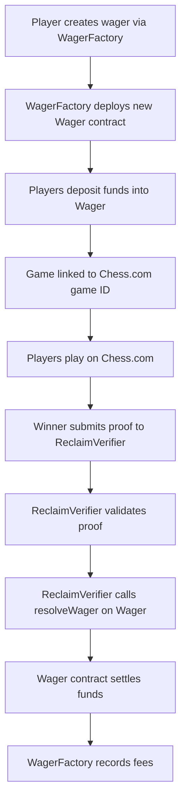

# ChainMate P2P Chess Wagering Platform

## 🚀 Latest Deployments

### Base Sepolia Testnet
- **Network**: Base Sepolia (Chain ID: 84532)
- **ReclaimVerifier**: `0xe9fa676e9e3d17f686ec00d83296d2b3a5b59481`
- **WagerFactory**: `0x8f3d2d8f8e9e9220df6558d6a866e902b437dd72`
- **Treasury**: `0x84c2f35807fC555C4A06cC12Dc0aAf9d948FeE1d`
- **Supported Tokens**: 
  - USDC: `0x036CbD53842c5426634e7929541eC2318f3dCF7e`
- **Explorer**: [View on BaseScan](https://sepolia.basescan.org/address/0x8f3d2d8f8e9e9220df6558d6a866e902b437dd72)

### Arbitrum Sepolia Testnet
- **Network**: Arbitrum Sepolia (Chain ID: 421614)
- **ReclaimVerifier**: `0xa8f1e4e4d04bce611f89308e27623bd15741cfe8`
- **WagerFactory**: `0x7a57bef7846f4c0c7dad4faa5a322ff8df4728c9`
- **Treasury**: `0x84c2f35807fC555C4A06cC12Dc0aAf9d948FeE1d`
- **Supported Tokens**: 
  - USDC: `0x75faf114eafb1BDbe2F0316DF893fd58CE46AA4d`
  - PYUSD: `0x637A1259C6afd7E3AdF63993cA7E58BB438aB1B1`
- **Explorer**: [View on Arbiscan](https://sepolia.arbiscan.io/address/0x7a57bef7846f4c0c7dad4faa5a322ff8df4728c9)

## 📋 Overview

ChainMate is a decentralized peer-to-peer wagering platform for chess games that leverages **Reclaim Protocol** for zero-knowledge proof verification of Chess.com game results. Players can create wagers, play on Chess.com, and have results automatically verified and settled on-chain.

## 🏗️ Architecture

The platform consists of three main smart contracts that work together:

### 1. **WagerFactory.sol** - The Entry Point
- **Purpose**: Creates and manages all wagers in the system
- **Key Functions**:
  - `createWager()` - Creates a new wager between two players
  - `addSupportedToken()` - Admin function to add new supported tokens
  - `recordFees()` - Tracks platform fees from settled wagers
- **Access Control**: Ownable pattern for admin functions
- **Fee Tracking**: Monitors total volume and fees collected

### 2. **Wager.sol** - The Core Logic
- **Purpose**: Individual wager contract with complete game lifecycle
- **State Machine**: `Created → Funded → GameLinked → Completed → Settled`
- **Key Functions**:
  - `creatorDeposit()` - Creator deposits their stake
  - `acceptWager()` - Opponent accepts and deposits their stake
  - `linkGame()` - Links the wager to a Chess.com game ID
  - `resolveWager()` - Called by ReclaimVerifier to set the winner
  - `settle()` - Distributes funds based on game outcome
- **Security Features**:
  - Reentrancy protection
  - 7-day timeout mechanism
  - Mutual cancellation voting
  - SafeERC20 for token transfers

### 3. **ReclaimVerifier.sol** - The Proof System
- **Purpose**: Verifies Chess.com game results using zero-knowledge proofs
- **Key Functions**:
  - `verifyChessGameProof()` - Main verification function
  - `validateProof()` - Preview function to check proof validity
- **Security Features**:
  - Replay protection (proof hash tracking)
  - 24-hour proof validity window
  - Participant address validation
  - Chess result parsing (1-0, 0-1, 1/2-1/2)

## 🔄 How They Work Together



### Detailed Flow:

1. **Wager Creation**: 
   - User calls `WagerFactory.createWager(opponent, token, amount, username)`
   - Factory deploys new `Wager` contract with all parameters
   - Factory tracks the wager and associates it with both players

2. **Funding Phase**:
   - Creator calls `wager.creatorDeposit()` to deposit their stake
   - Opponent calls `wager.acceptWager(username)` to deposit and accept
   - Wager moves to `Funded` state

3. **Game Linking**:
   - Either player calls `wager.linkGame(gameId)` with Chess.com game ID
   - Wager moves to `GameLinked` state
   - Players can now play their game on Chess.com

4. **Proof Submission**:
   - After game completion, either player submits proof to `ReclaimVerifier`
   - `ReclaimVerifier.verifyChessGameProof()` validates the ZK proof
   - If valid, calls `wager.resolveWager(winner, result)`

5. **Settlement**:
   - Anyone can call `wager.settle()` after resolution
   - Funds distributed: Winner gets 98% of pot, 2% fee to treasury
   - For draws: Each player gets 49% back, 1% fee each to treasury
   - `WagerFactory.recordFees()` called to track platform metrics

## 🛡️ Security Features

- **Access Control**: Only ReclaimVerifier can resolve wagers
- **Reentrancy Protection**: NonReentrant modifiers on critical functions
- **Timeout Mechanism**: 7-day timeout for incomplete games
- **Proof Replay Protection**: Each proof can only be used once
- **Participant Validation**: Only wager participants can submit proofs
- **Safe Token Transfers**: OpenZeppelin SafeERC20 implementation

## 🧪 Testing

The contracts include comprehensive test suites:

```bash
# Run all tests
npx hardhat test

# Run specific test file
npx hardhat test test/wager.ts
```

**Test Coverage**:
- ✅ 16/16 core functionality tests passing
- ✅ Wager creation and acceptance
- ✅ Game linking and state transitions
- ✅ Access control and security checks
- ✅ Fee calculations and distributions
- ⚠️ Settlement tests temporarily disabled (known issue with test setup)

## 🚀 Deployment

### Prerequisites
```bash
npm install
cp .env.example .env
# Add your PRIVATE_KEY and RPC URLs to .env
```

### Deploy to Testnets
```bash
# Base Sepolia
npx hardhat run scripts/deploy-factory-only.ts --network baseSepolia

# Arbitrum Sepolia  
npx hardhat run scripts/deploy-factory-only.ts --network arbitrumSepolia
```

## 📝 Usage Example

```javascript
// 1. Create a wager
const wagerAddress = await wagerFactory.createWager(
  "0x...opponent", 
  "0x...usdcToken", 
  ethers.parseUnits("10", 6), // 10 USDC
  "myChessUsername"
);

// 2. Deposit funds
const wager = new ethers.Contract(wagerAddress, WagerABI, signer);
await usdc.approve(wagerAddress, ethers.parseUnits("10", 6));
await wager.creatorDeposit();

// 3. Opponent accepts
await wager.connect(opponent).acceptWager("opponentUsername");

// 4. Link Chess.com game
await wager.linkGame("chess.com/game/12345");

// 5. After game, submit proof
await reclaimVerifier.verifyChessGameProof(
  encodedProof,
  wagerAddress, 
  whitePlayerAddress,
  blackPlayerAddress
);

// 6. Settle
await wager.settle();
```

## 🔧 Configuration

### Supported Networks
- **Base Sepolia**: Fast, low-cost L2 for testing
- **Arbitrum Sepolia**: Alternative L2 with different token ecosystem

### Supported Tokens
- **Base**: USDC (native)
- **Arbitrum**: USDC, PYUSD

### Fee Structure
- **Winner**: 2% platform fee
- **Draw**: 1% fee per player
- **Timeout**: Funds returned minus gas costs

## 🎯 Next Steps

1. **Frontend Integration**: Build React app with wagmi/viem
2. **Reclaim Integration**: Implement actual Chess.com proof verification
3. **Mainnet Deployment**: Deploy to Base and Arbitrum mainnet
4. **Additional Features**: 
   - Multi-game tournaments
   - Rating-based matchmaking
   - Staking rewards
   - Cross-chain wagering

## 📄 License

MIT License - see LICENSE file for details.

---

**⚠️ Testnet Only**: These contracts are deployed on testnets for development and testing purposes. Do not use with real funds on mainnet without proper auditing.