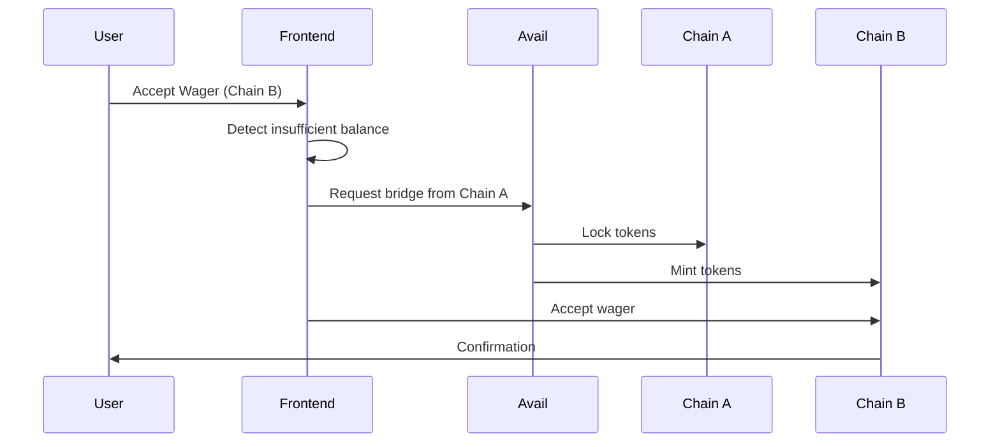

# ChainMate Frontend

> Next.js 14 frontend application with Web3 integration, Blockscout SDK, and Avail Nexus support

## 🏗️ Tech Stack

- **Framework**: Next.js 14 (App Router)
- **Language**: TypeScript
- **Styling**: Tailwind CSS + shadcn/ui
- **Web3**: Wagmi v2 + Viem
- **State Management**: React Hooks + TanStack Query
- **Blockchain Explorer**: Blockscout SDK
- **Cross-Chain**: Avail Nexus SDK

---

## 📁 Project Structure

```
frontend/
├── app/                      # Next.js App Router
│   ├── layout.tsx           # Root layout with providers
│   ├── page.tsx             # Landing page
│   ├── dashboard/           # Dashboard page
│   ├── wagers/              # Wager pages
│   │   ├── new/            # Create wager
│   │   └── [id]/           # Wager details
│   └── stats/              # User statistics
│
├── components/              # React components
│   ├── ui/                 # shadcn/ui components
│   ├── navbar.tsx          # Navigation bar
│   ├── wager-card.tsx      # Wager display card
│   ├── wager-form.tsx      # Create wager form
│   ├── blockscout-provider.tsx  # Blockscout SDK wrapper
│   └── web3-provider.tsx   # Web3 configuration
│
├── lib/                    # Utilities and hooks
│   ├── hooks.ts           # Smart contract hooks
│   ├── utils.ts           # Helper functions
│   └── constants.ts       # App constants
│
├── hooks/                  # Custom React hooks
│   └── use-cross-chain-accept.ts  # Avail Nexus integration
│
└── public/                # Static assets
    └── logo.jpg           # ChainMate logo
```

---

## 🚀 Getting Started

### Prerequisites

- Node.js 18+
- npm or yarn
- MetaMask or compatible wallet

### Installation

```bash
# Install dependencies
npm install

# Copy environment variables
cp .env.example .env.local

# Start development server
npm run dev
```

### Environment Variables

Create `.env.local`:

```env
# WalletConnect
NEXT_PUBLIC_WALLETCONNECT_PROJECT_ID=your_project_id

# RPC URLs
NEXT_PUBLIC_BASE_SEPOLIA_RPC_URL=https://sepolia.base.org
NEXT_PUBLIC_ARBITRUM_SEPOLIA_RPC_URL=https://sepolia-rollup.arbitrum.io/rpc

# Contract Addresses - Base Sepolia
NEXT_PUBLIC_BASE_WAGER_FACTORY_ADDRESS=0x...
NEXT_PUBLIC_BASE_RECLAIM_VERIFIER_ADDRESS=0x...
NEXT_PUBLIC_BASE_USDC_ADDRESS=0x...
NEXT_PUBLIC_BASE_USDT_ADDRESS=0x...

# Contract Addresses - Arbitrum Sepolia
NEXT_PUBLIC_ARBITRUM_WAGER_FACTORY_ADDRESS=0x...
NEXT_PUBLIC_ARBITRUM_RECLAIM_VERIFIER_ADDRESS=0x...
NEXT_PUBLIC_ARBITRUM_USDC_ADDRESS=0x...
NEXT_PUBLIC_ARBITRUM_USDT_ADDRESS=0x...

# Avail Nexus (optional)
NEXT_PUBLIC_AVAIL_NEXUS_ENABLED=true
```

---

## 🔌 Key Integrations

### 1. Blockscout SDK

**Location**: `components/blockscout-provider.tsx`

The Blockscout SDK provides transaction tracking and explorer integration.

```typescript
import { useNotification, useTransactionPopup } from '@blockscout/app-sdk'

// Show transaction toast
const { openTxToast } = useNotification()
openTxToast(chainId.toString(), txHash)

// Open transaction history popup
const { openPopup } = useTransactionPopup()
openPopup()
```

**Features**:
- ✅ Transaction toast notifications
- ✅ Transaction history popup
- ✅ Direct links to Blockscout explorer
- ✅ Real-time status updates

**Implementation**:
```tsx
// app/layout.tsx
<BlockscoutProvider>
  <NotificationProvider>
    <TransactionPopupProvider>
      {children}
    </TransactionPopupProvider>
  </NotificationProvider>
</BlockscoutProvider>
```

---

### 2. Avail Nexus - Cross-Chain

**Location**: `hooks/use-cross-chain-accept.ts`

Enables users to accept wagers with funds from different chains.

```typescript
import { useCrossChainAccept } from '@/hooks/use-cross-chain-accept'

const {
  acceptCrossChain,
  isLoading,
  isBridging,
  needsCrossChain
} = useCrossChainAccept()

// Accept wager with cross-chain bridging
await acceptCrossChain(
  wagerAddress,
  targetChainId,
  'USDC',
  amount,
  decimals,
  username
)
```

**Flow**:


---

### 3. Wagmi + Viem - Web3

**Location**: `components/web3-provider.tsx`

Web3 configuration with multi-chain support.

```typescript
import { useAccount, useWriteContract } from 'wagmi'

// Get connected account
const { address, isConnected } = useAccount()

// Write to contract
const { writeContract } = useWriteContract()
writeContract({
  address: contractAddress,
  abi: CONTRACT_ABI,
  functionName: 'createWager',
  args: [opponent, token, amount, username]
})
```

**Supported Networks**:
- Base Sepolia (84532)
- Arbitrum Sepolia (421614)

---

## 🎨 Components

### Core Components

#### WagerCard
Displays wager information in a card format.

```tsx
<WagerCard 
  wager={{
    id: "0x123...",
    creator: "0xabc...",
    amount: 10,
    tokenSymbol: "USDC",
    status: "open"
  }}
/>
```

#### WagerForm
Form for creating new wagers with auto-chain transaction flow.

```tsx
<WagerForm />
```

**Features**:
- Auto-chain approve → create → deposit
- Progress modal with step tracking
- Gas estimation
- Error handling with retry

#### TransactionProgressModal
Shows transaction progress for multi-step operations.

```tsx
<TransactionProgressModal
  isOpen={showProgress}
  steps={[
    { name: "Approve USDC", status: "success" },
    { name: "Create Wager", status: "active" },
    { name: "Deposit Funds", status: "pending" }
  ]}
  currentStep={1}
  message="Creating wager..."
/>
```

---

## 📊 Custom Hooks

### useCreateWager
Creates a new wager contract.

```typescript
const { createWager, isPending, isSuccess } = useCreateWager()

await createWager(
  opponentAddress,
  tokenAddress,
  amount,
  decimals,
  username
)
```

### useAcceptWager
Accepts an existing wager.

```typescript
const { acceptWager, isPending, isSuccess } = useAcceptWager()

await acceptWager(wagerAddress, username)
```

### useWagerData
Fetches wager data from contract.

```typescript
const { data: wagerData, isLoading } = useWagerData(wagerAddress)

// wagerData contains:
// - creator, opponent, token, amount
// - state, winner, gameId
// - timestamps, usernames
```

### useCrossChainAccept
Handles cross-chain wager acceptance.

```typescript
const { 
  acceptCrossChain,
  isLoading,
  isBridging,
  needsCrossChain 
} = useCrossChainAccept()
```

---

## 🎯 Pages

### Landing Page (`/`)
- Hero section
- Feature highlights
- Call-to-action buttons

### Dashboard (`/dashboard`)
- Available wagers (to accept)
- My wagers (created/accepted)
- Pagination with "Load More"
- Real-time updates

### Create Wager (`/wagers/new`)
- Wager creation form
- Token selection
- Opponent address input
- Chess.com username
- Auto-chain transaction flow

### Wager Details (`/wagers/[id]`)
- Wager information
- Transaction history (Blockscout)
- ZK verification status
- Action buttons (accept, deposit, link game, settle)
- Cross-chain accept option

### Stats Page (`/stats`)
- Total wagered
- Total won
- Win rate
- Net profit
- Game history

---

## 🎨 Styling

### Tailwind CSS

Custom configuration in `tailwind.config.ts`:

```typescript
theme: {
  extend: {
    colors: {
      border: "hsl(var(--border))",
      background: "hsl(var(--background))",
      foreground: "hsl(var(--foreground))",
      // ... shadcn/ui colors
    }
  }
}
```

### Dark Mode

Automatic dark mode support via `next-themes`:

```tsx
<ThemeProvider attribute="class" defaultTheme="system">
  {children}
</ThemeProvider>
```

---

## 🧪 Testing

```bash
# Run tests
npm test

# Run tests in watch mode
npm test:watch

# Coverage
npm test:coverage
```

---

## 🏗️ Build & Deploy

```bash
# Build for production
npm run build

# Start production server
npm start

# Export static site
npm run export
```

### Deployment Options

- **Vercel** (Recommended)
- **Netlify**
- **AWS Amplify**
- **Self-hosted**

---

## 🔧 Configuration

### Next.js Config

```javascript
// next.config.js
module.exports = {
  reactStrictMode: true,
  webpack: (config) => {
    config.resolve.fallback = { fs: false, net: false, tls: false }
    return config
  }
}
```

### TypeScript Config

```json
{
  "compilerOptions": {
    "target": "ES2020",
    "lib": ["dom", "dom.iterable", "esnext"],
    "jsx": "preserve",
    "module": "esnext",
    "moduleResolution": "bundler",
    "paths": {
      "@/*": ["./*"]
    }
  }
}
```

---

## 📱 Responsive Design

All components are mobile-responsive:

- Mobile: < 768px
- Tablet: 768px - 1024px
- Desktop: > 1024px

```tsx
<div className="grid gap-4 md:grid-cols-2 lg:grid-cols-3">
  {/* Responsive grid */}
</div>
```

---

## 🐛 Debugging

### Enable Debug Logs

```typescript
// lib/hooks.ts
const DEBUG = true

if (DEBUG) {
  console.log('Wager data:', wagerData)
}
```

### React DevTools

Install React DevTools browser extension for component inspection.

### Wagmi DevTools

```tsx
import { WagmiDevTools } from 'wagmi'

<WagmiDevTools />
```

---

## 📚 Resources

- [Next.js Documentation](https://nextjs.org/docs)
- [Wagmi Documentation](https://wagmi.sh)
- [Blockscout SDK](https://docs.blockscout.com/devs/sdk)
- [Avail Nexus](https://docs.availproject.org/nexus)
- [shadcn/ui](https://ui.shadcn.com)

---

---

**Built with Next.js 14 and ❤️**
